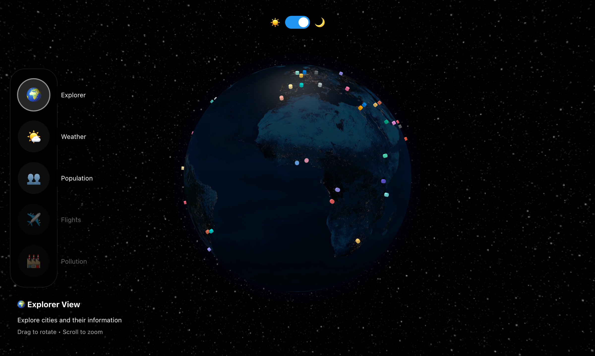

# Globe.io

An interactive 3D globe visualization showcasing major cities around the world with interesting trivia and facts.



## Features

- Interactive 3D globe built with Three.js and react-globe.gl
- 30 major cities from around the world
- Comprehensive city data including population, area, founding date, timezone, and famous landmarks
- Click on city markers to learn detailed information
- Hover tooltips with quick city stats
- Smooth camera animations when selecting cities
- Beautiful night-themed globe with atmospheric effects

## Getting Started

### Prerequisites

- Node.js (v16 or higher)
- MongoDB (local installation or MongoDB Atlas)
- npm or yarn

### Quick Start (Recommended)

The easiest way to get started is using the bootstrap script:

```bash
npm run bootstrap
```

This script will automatically:
- ✅ Check if MongoDB is running (start it if needed)
- ✅ Install all dependencies
- ✅ Create and seed the database
- ✅ Start the backend API server
- ✅ Start the frontend development server

Then open [http://localhost:5173](http://localhost:5173) in your browser.

### Manual Setup

If you prefer to set things up manually:

#### 1. Install MongoDB

**macOS:**
```bash
brew tap mongodb/brew
brew install mongodb-community
brew services start mongodb-community
```

**Linux (Ubuntu/Debian):**
```bash
sudo apt-get install mongodb
sudo systemctl start mongod
```

**Windows:**
Download from [MongoDB Download Center](https://www.mongodb.com/try/download/community)

#### 2. Install Dependencies

```bash
# Install frontend dependencies
npm install

# Install backend dependencies
cd server && npm install
```

#### 3. Seed Database

```bash
npm run seed
```

#### 4. Start Development Servers

In one terminal:
```bash
npm run dev:server
```

In another terminal:
```bash
npm run dev
```

Then open [http://localhost:5173](http://localhost:5173) in your browser.

### Available Scripts

**Lifecycle:**
- `npm start` or `npm run bootstrap` - Smart bootstrap (starts everything)
- `npm stop` - Stop frontend & backend (keeps MongoDB & data)
- `npm run stop:all` - Stop everything including MongoDB (keeps data)

**Development:**
- `npm run dev` - Start frontend development server only
- `npm run dev:server` - Start backend API server only
- `npm run seed` - Seed MongoDB database with city data

**Build:**
- `npm run build` - Build frontend for production
- `npm run preview` - Preview production build
- `npm run lint` - Run ESLint

## Technologies Used

### Frontend
- React 18
- TypeScript
- Vite
- react-globe.gl
- Three.js

### Backend
- Node.js & Express
- MongoDB with Mongoose
- RESTful API
- Geospatial indexing for location queries

## How to Use

1. Drag the globe to rotate and explore
2. Scroll to zoom in/out
3. Click on any city marker to view detailed information
4. Hover over markers to see quick info

## Cities Featured

Explore 30 major cities from around the world:

**Asia-Pacific:**
- Tokyo, Japan
- Beijing, China
- Shanghai, China
- Seoul, South Korea
- Singapore
- Bangkok, Thailand
- Jakarta, Indonesia
- Mumbai, India
- Delhi, India
- Sydney, Australia
- Melbourne, Australia

**Americas:**
- New York, USA
- Los Angeles, USA
- Toronto, Canada
- Mexico City, Mexico
- São Paulo, Brazil
- Rio de Janeiro, Brazil
- Buenos Aires, Argentina

**Europe:**
- London, UK
- Paris, France
- Berlin, Germany
- Rome, Italy
- Madrid, Spain
- Barcelona, Spain
- Amsterdam, Netherlands
- Moscow, Russia

**Middle East & Africa:**
- Dubai, UAE
- Istanbul, Turkey
- Cairo, Egypt
- Lagos, Nigeria
